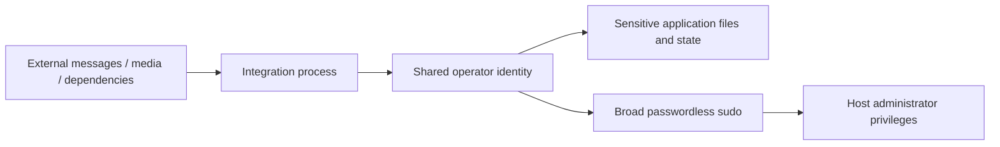
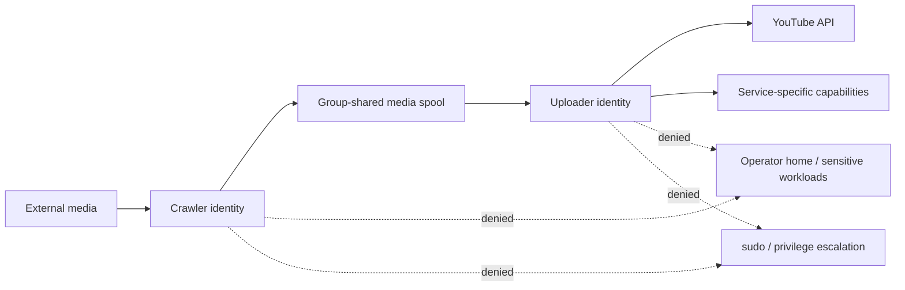
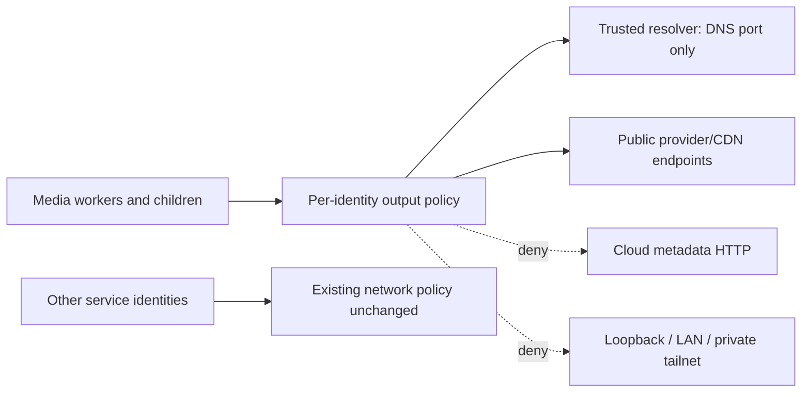

# Code before and after: reducing the integration's blast radius

**Historical application changes: July 10, 2026.** These sanitized excerpts reconstruct the actual changes specified by the retained transformation program and service templates. Secret values are replaced with explicit placeholders and unrelated lines are omitted. The source artifacts are linked to their fingerprints in `EVIDENCE-PROVENANCE.json`.

## 1. Webhook capability moved out of application source

```diff
- DISCORD_WEBHOOK_URL = "<REDACTED_NOTIFICATION_WEBHOOK>"
+ def _read_systemd_credential(name):
+     credential_dir = os.environ.get("CREDENTIALS_DIRECTORY", "")
+     if not credential_dir:
+         raise RuntimeError("systemd credential directory is unavailable")
+     with open(os.path.join(credential_dir, name), "r", encoding="utf-8") as credential:
+         return credential.read().strip()
+
+ DISCORD_WEBHOOK_URL = _read_systemd_credential("discord_webhook")
```

The service supplies the credential through `LoadCredential`; the repository and ordinary source copies do not need the real endpoint. This reduces accidental disclosure through code sharing. It does not revoke the original webhook or prevent an already-compromised uploader process from using its own notification capability.

## 2. Cookie values removed from process arguments

```diff
- if cookie_val:
-     cmd.extend(["--http-header", f"Cookie={cookie_val}"])
- cmd = [STREAMLINK_BIN, "--ffmpeg-copyts", ...]
+ cmd = [STREAMLINK_BIN, "--config", STREAMLINK_CONFIG_FILE,
+        "--ffmpeg-copyts", ...]
```

The before excerpt combines the removed argument block with the command construction to make the change visible; it is not intended as a complete executable function. The new helper writes the runtime configuration with mode `0600` in a mode-`0700` service runtime directory. It rejects carriage-return/newline characters in cookie fields before constructing the configuration line. Values are not shown in this repository.

**Why it matters:** process-argument inspection and copied command lines no longer expose cookie values. The service still legitimately holds its own authentication material; privileged administrators remain trusted.

## 3. Writable state separated from root-owned code

```diff
- LOG_FILE = os.path.join(base_path, "upload_log.txt")
+ LOG_FILE = os.environ.get(
+     "UPLOADER_LOG_FILE", os.path.join(base_path, "upload_log.txt")
+ )
```

The historical transformer applied the same path-injection pattern to download data, uploaded-file history, retry state, lock files and authentication inputs. The deployed unit places logs and state in service-owned directories and code in a root-owned read-only directory.

The fallback expression is retained for compatibility; the unit's explicit environment is the important production binding. Merely introducing an environment variable would not establish isolation.

**Compatibility lesson:** the later July troubleshooting record reported a file-log path/permission regression while stdout journaling continued. The current log-directory ownership was inspected separately; this repository does not hide the historical regression or claim a new end-to-end logging test from directory permissions alone.

## 4. Dedicated identity and operating-system sandbox

Conceptual unit delta, supported by the historical deployment reports and candidate templates:

```diff
- User=<shared_operator_account>
- # External integration shares the operator trust domain.
+ User=svc_uploader
+ Group=svc_uploader
+ SupplementaryGroups=media_pipeline
+ NoNewPrivileges=yes
+ CapabilityBoundingSet=
+ AmbientCapabilities=
+ ProtectSystem=strict
+ ProtectHome=yes
+ PrivateDevices=yes
+ ReadWritePaths=/var/lib/auto-uploader /var/log/auto-uploader
+ ReadWritePaths=/var/lib/media-pipeline/download /run/auto-uploader
```

The crawler uses a different identity. Both share only the required media group. The Discord command bot's separate historical design exposed a fixed report-file set read-only, rather than the entire operator directory.

## 5. Trust-boundary diagram

### Before: one compromise can cross the shared account boundary



This diagram describes the conditional attack path identified in the old design. It does not assert that any step was exploited.

### After July: constrained application identities



### October follow-up: add an independent network boundary



This October control was subsequently **deployed and verified on October 8, 2026**. The initial evidence commit predates its successful rollout. See [VERIFICATION.md](VERIFICATION.md) for exact before/after evidence and [media_egress_guard.py](media_egress_guard.py) for the implemented policy.

## Source anchors

- Historical `transform_uploader.py`: exact replacement anchors, credential loader, cookie-argument removal, syntax check and rejection of a remaining webhook literal.
- Historical `prepare_streamlink_config.py`: newline validation and `0600` runtime output.
- Historical `auto-uploader.service`: identity, credential delivery, runtime directory, explicit paths and sandbox controls.
- Historical deployment report: actual reported service identities, boundary checks and continuity observations.

The source fingerprints are retained in `EVIDENCE-PROVENANCE.json`. No legacy transformer is executed during this reconstruction, since that execution would read and extract the old credential value.
