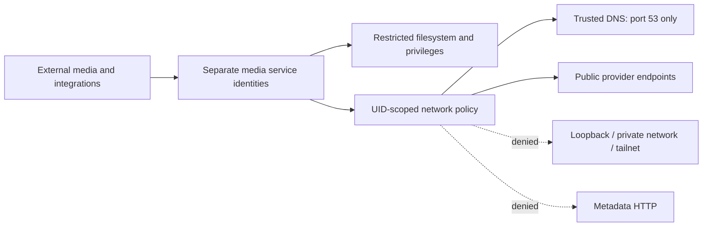

# Cloud media pipeline: security analysis and verified remediation

**Owner-administered Oracle Linux · Python / Node.js automation · Least privilege · Network isolation**

This project documents defensive security work on infrastructure maintained by **[hwangbo0718](https://github.com/qhdnzm)**: identifying excessive trust between externally connected services and a privileged operator account, reducing credential exposure, and enforcing a separate network boundary around media workers.

**Start here: [Security assessment and remediation report](SECURITY-REPORT.md)**

**Application scope: [Work and whose systems it covers](CVP-WORK-SUMMARY.md)**

Original remediation: **July 2026**. Follow-up implementation, live verification and publication: **October 2026**. Times in the evidence are KST (UTC+9).

## Outcome

| Security or compatibility property | Observed result |
| --- | --- |
| Targeted internal connections from the two media identities | **10/10 denied after remediation**; reachable in the baseline |
| Public-provider TLS connectivity from those identities | **8/8 passed** with certificate verification |
| Trusted DNS | Preserved with a destination-port-53 exception |
| Operator-account control probes | Unchanged |
| Existing uploader and crawler | Same PIDs and restart counts across the accepted deployment |
| Published history at revision `9c375f0` | **0 Gitleaks findings** across 2 commits and 22 current files |

The network results cover controlled TCP, DNS and TLS checks. They do not assert a completed upload or an exploited application vulnerability. [Method, receipts and limits →](VERIFICATION.md)

## The security problem

The original integrations processed external messages and media within the operator's privileged trust domain. A compromised integration could therefore reach unrelated application files and broad administrative privileges. The July remediation separated service identities, constrained filesystem access, made code root-owned, and moved sensitive values out of application source and process arguments.

The October assessment confirmed that filesystem isolation alone left another boundary open: media-worker identities could still connect to the host's loopback, private and tailnet addresses and the cloud metadata HTTP port. A UID-scoped nftables policy now contains that traffic independently of the Python, Node.js and media-processing code.

## Engineering decisions that matter

- **DNS and metadata share an address.** Allowing that whole address for DNS would also permit metadata HTTP. The exception matches both the resolver address and TCP/UDP port 53.
- **Packet ownership is matched positively.** Only the two media socket UIDs enter the restricted chain, avoiding accidental interference with unrelated or ownerless kernel packets.
- **Denial is supported by controls.** Live loopback listeners, before/after probes, a working operator-account control and exact reject counters distinguish a firewall rejection from a missing service.
- **The fix preserves operations.** Atomic replacement affects one dedicated nftables table. The deployment and a subsequent guard reload preserved the running media processes. Exact-scope rollback and corrected rollout attempts are documented.

## Evidence and implementation

| Review question | Evidence |
| --- | --- |
| What was affected, and under what conditions? | [Security report](SECURITY-REPORT.md) |
| What actually changed in the application and service boundary? | [Before/after code and diagrams](CODE-BEFORE-AFTER.md) |
| What was deployed in July? | [Historical remediation](HISTORY.md) · [source-document fingerprints](EVIDENCE-PROVENANCE.json) |
| How does the October network control work? | [Control design](CONTROL-DESIGN.md) · [deployed helper](media_egress_guard.py) · [systemd unit](media-egress-guard.service) |
| Can the results be checked? | [Verification](VERIFICATION.md) · [before](NETWORK-BEFORE.json) / [after](NETWORK-AFTER.json) · [bounded probe](probe_media_egress.py) |
| Does the published implementation match deployment? | [Deployment receipt](DEPLOYMENT-RECEIPT.json) · [installed hashes](INSTALLED-SHA256.txt) |
| What remains to improve? | [Current assessment and risk register](CURRENT-ASSESSMENT.md) |
| Was the original published history scanned for secrets? | [Secret-scan receipt](SECRET-SCAN.json) |

## Ownership, methodology and scope

The assessed server and deployed automation are owner-administered infrastructure. Findings are supported by retained source artifacts and authorized tests on that infrastructure. Third-party provider fronts received ordinary anonymous TLS connections; provider systems were not subjected to vulnerability testing.

This is an owner-published security assessment and remediation case study. Historical deployment reports, current measurements and future proposals are labeled separately. Actual host addresses, authentication material, private media and full production logs are excluded; verification scope and remaining work are retained in the linked evidence.
